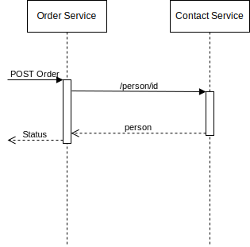
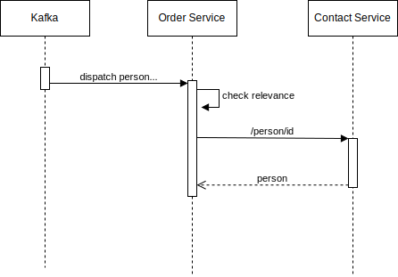

# Programming Challenge

Dear applicant,

Congratulations, you made it to the Programming Challenge!

Why do we ask you to complete this challenge?

First of all, we need to have some way of comparing different applicants, and we try to answer certain questions which we can not out-right ask in an interview - also we don't want to ask too many technical questions in a face-to-face interview to not be personally biased in a potentially stressful situation. To be as transparent as possible, we want to give you some insights into what we look at and how we evaluate. This challenge gives you the possibility to shine :). Impress us with **simplicity**, understanding of your own solution and of course **working code**.

## Challenge

The following challenge has to be solved. You will find specific tasks and deliverables in the subsequent sections.

Note that there is nothing wrong with googling when you have certain questions or are unsure about some APIs, but you should not outright copy code that you don't understand. If you decide to copy code, please mark it as copied citing the source.

## Challenge: Implementation

What we are looking into:

- Clean, simple and understandable code 
- Analytical / problem-understanding / problem-solving skills
- Ability to execute / implement 
- Ability to explain why you picked a certain solution and why you rejected possible alternatives
- Ability to challenge proposed solutions (business wise and technically) and identify more efficient or better ways forward

## Task 1: Get the sample application "Up and Running"

The sample application is a very simple microservice that manages persons/contacts. The service is dockerized and comes with a [docker-compose file](docker-compose.yaml) that helps you set it up quickly. To run it you need docker (incl. compose) and an internet connection. 

You start the application it with `docker-compose up -d`. This will create the following setup:

The Application exposes a REST API that is described with an [OpenAPI 3.0 compliant specification](assets/contact_service_openapi.yaml). This specification is also available on the running service under [http://localhost:8080/swagger-ui/](http://localhost:8080/swagger-ui/).

Every create / update / delete operation on a "Person" entity will result in the creation of a CloudEvent 1.0 compliant message in Kafka. There are 3 topics that will be used:

* personevents-created
* personevents-changed
* personevents-deleted

Your task is to use the API to create, change and delete contacts. Then shell into the Kafka container (`docker exec`) and use the native Kafka scripts to print the event log contained within the topics metioned before. The scripts are located in `/opt/bitnami/kafka/bin`. Remember that inside the container your bootstrap server is `kafka:9092` and on your laptop it is `localhost:9093`.

Congrats! Now you are ready to begin the actual develpment work!

## Task 2: Create a new service to capture orders

Now it is your time to develop a similar service and to integrate it into the landscape. Whilst you are entirely free in your technology choices (databases, frameworks, languages, etc.), we want your service to fulfill the following critera:

* Offer a REST API that complies to the provided [OpenAPI 3.0 spec](assets/order_service_openapi.yaml)
* Publish events for create, update and delete operations to the existing Kafka Broker (events should follow the [CloudEvents 1.0 spec](https://github.com/cloudevents/spec/blob/v1.0.1/json-format.md))

One thing you should ensure is that person data is sourced from the previously deployed service and fully persisted to the local database (order read operations should not require the contact service to be up and running). The input API will provide the neccessary ID reference. In case the reference is invalid (does not exist or can't be checked), the order API should send an error. The basic flow is depicted in the below sequence diagram.

In order to not overcopmlicate things:
 * You don't need to do excessive error handling, however please explain where you compromised and how you would do it properly
 * No need for automated tests
 * If you think certain ideas are too much effort to implement, just explain them 
 * Service is not responsible for calculations (ATP, Price, etc.) it is "just persistency"

## Task 3: Subscribe to Contact Updates from Contact Service

For now your service only stores a snapshot of the referenced contact persons. This means the local database is out of sync when changes are made to contacts post order creation / manipulation. To ensure eventual consistency, you should now subscribe to the respective person events (topics personevents-created, personevents-changed, personevents-deleted) and ensure the concerned orders reflect the updates. This behavior is described in the below sequence diagram:

After you have implemented the functionality, take a step back and think about the implementation. What were tradeoff decisions you had to take. What do they mean to things like scalability, performance, consistency, .... Would there be better designs to achieve the same goal?

## Task 4: Create a UI

Now the backend is ready and waiting for some action. Since you are a fullstack engineer, you should now create a frontend to control the 2 services. Don't overcomplicate things, in fact less is more. We are hiring developers, not designers. 

However, there is one thing to think about for your presentation: Microservices allow teams to work decoupled. Joining the frontend seems to be counterintuitive. Please explain how you would propose to overcome the dilemma and what the implications are.

## Task 5: Presentation

Congratulations you have completed the technical part of your challenge. Now you need to sell it to us ;-). For that we would expect the following to be handed in once your deadline is expired:

* Short Word document summary highlighting: Architecture ([original architecture is available as drawio](assets/Architecture.drawio)), choices made and reasons (Language, database, etc.), proposed improvements, what worked and what not, how you would propose to handle security)
* Complete Source Code 
* Amended docker-compose file (to re-create your setup on our own infrastructure)

**Please send back your solution as git repository (including .git folder) packed as zip archive.**

During the meeting we would follow the below structure:

* Demo of your Solution:
  * Backend: Provide a script that wraps your CLI and shows the various operations (also log out the event stream on a seperate window)
  * Frontend: Interactive demo of your UI
* Joint discussion of your previously handed-in word document
* Presentation of your source code structure with questions and answers
* Open Questions that will mainly ask you for reasons of choices you made (language, database, framework, etc.). It is very important to be honest here. If you picked Java as a language because it is the only one you know, don't make up things just say it. 
